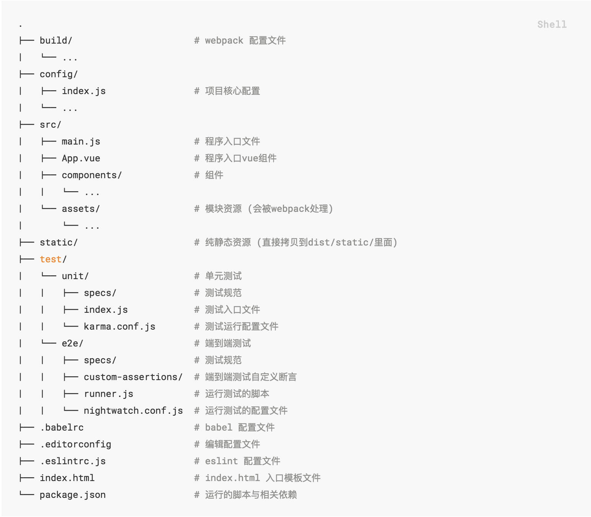

## vue技术栈学习

<!-- TOC -->

- [vue技术栈学习](#vue技术栈学习)
    - [vue基础](#vue基础)
    - [目录结构](#目录结构)
    - [webpack](#webpack)
    - [vue-loader](#vue-loader)
        - [vue-cli](#vue-cli)
    - [vue-router](#vue-router)
    - [axios](#axios)
        - [使用](#使用)
        - [promise](#promise)
        - [qr库](#qr库)
    - [Vuex(全局存储)](#vuex全局存储)

<!-- /TOC -->

vue是国人尤雨溪开发的web框架. 基于 Vue.js及其技术栈, 我们可以更方便的构建复杂的单页/多页应用:
- 工具
  - 方便的脚手架工具 vue-cli
  - 成熟的模块管理器 webpack + vue loader
  - 成熟的路由管理器 vue-route
  - 成熟的http库 axios
  - ...
- 响应式UI, UI与数据绑定 等思想与设计.
总之, 学习vue需要学习其一套技术栈, 而且vue挺好用的(如果只是写着玩玩就没必要了, 复杂的香满园还是很有用的)

类似的框架还有 React, AngularJS 等. 对比什么的我就不写了, 毕竟是个菜鸡前端, [大家看官方对比吧](https://cn.vuejs.org/v2/guide/comparison.html#React). 我就给大家整个段子看看得了.


学习vue之前你应该对 html+js+css 有一定的认知(css可以少些, 毕竟好看难看都能看...)

### vue基础
- [官方文档](https://cn.vuejs.org/v2/guide/)

通过官方文档学习即可. 建议如下
- 基础部分 大概看看, 浏览一遍即可, 知道都有那些功能, 大该如何使用.
- 深入了解组建部分 大概看看, 大概知道都有那些功能.
- 注意了解下 单文件组件, 这是后面使用vue构建复杂应用的基础.

如果只是构建简单的应用, 使用这些基础功能就ok了. 但是如果想构建复杂应用, 接下来还需要了解: webpack, vue-loader.

### 目录结构
一般复杂的vue项目的结构按如下规则设置: 
- [参考: vue-cli-项目结构](https://loulanyijian.github.io/vue-cli-doc-Chinese/structure.html)

vue/webpack 项目启动流程如下: 首先读取 `build/webpack.base.conf.js` 配置文件, 其中 entry 节点定义了项目的入口, 然后
- webpack 通过配置文件加载 main.js(假设entry节点定义入口为main.js)
- main.js 加载 App.vue, App.vue是 vue渲染 的入口
- main.js 加载 router, 把准备好路由组件注册到路由里
    - 注: vue项目中，导入一个目录, 会自动导入目录下的index.js
- ...(你想注册的任何组件都可以在这里全局注册)

由webpack根据 build/ 下配置构建项目, 生成到 dist/ 目录下

### webpack
- [官方文档](https://www.webpackjs.com/concepts/)

webpack介绍参照官方文档第一句话: 
> 本质上, webpack 是一个现代 JavaScript 应用程序的静态模块打包器(module bundler). 当 webpack 处理应用程序时, 它会递归地构建一个依赖关系图(dependency graph), 其中包含应用程序需要的每个模块, 然后将所有这些模块打包成一个或多个 bundle.

我理解的webpack就是, 帮我搞定项目的依赖, 打包依赖并且构建最终 线上部署的前端项目. 同时我也可以通过各种配置定制构建规则.

如果在项目构建方面有要求或者有问题的话, 就在webpack里寻找方案.

使用
- 任何在 static/ 中的内容会被直接复制到 dist/static 下, 而不经过webpack处理(如图示)

### vue-loader
- [官方文档](https://vue-loader.vuejs.org/zh/)

vue loader 是一个webpack的加载器.

对于复杂的项目, 通常是拆分成多个组件, 每个组件都是一个 .vue文件(单文件组件). vue-loader 的核心功能就是用来解释这些vue组件, 以方便webpack将项目构建为 js+css+html 组成的最终文件.

除此之外, vue支持 scoped CSS, 加上此限制的css将会限制只在本组件内有效. (构建为最终文件时, vue-loader会将)

构建的最终项目中, webpack和vue-loader中有一个会将项目中所有css/js的name/id转化为随机不重复值(忘记是哪个了)

#### vue-cli
vue-cli是创建 webpack+vue-loader 项目的脚手架. (ps: 这个对初学者很有用)

vue-loader 包含 vue-cli 工具. 为了做到开箱即用, 通过vue-cli创建的项目会针对多数常见的需求进行了预先设置.

### vue-router
- [官方文档](https://router.vuejs.org/zh)

vue router 是 Vue.js 官方的路由管理器, 使你更方便的构建单页应用.

使用(vue-loader项目):
```js
// main.js
import router from './router'
new Vue({
  ...
  router,
  ...
})

// router/index.js
import Router from 'vue-router'
Vue.use(Router)
export default new Router({
  mode: 'history',
  routes: [{
      path: "*",
      redirect: "/"
    },
    {
      path: '/',
      name: 'Home',
      component: Hello,
      meta: {
        title: 'Welcome'
      }
    }
  ]
}
```

注意:
1. `this.$router` 和 `this.$route` 的区别
    - `this.$router` 用来控制路由切换, 拥有 `.push/.pop()` 方法
    - `this.$route` 用来获取当前页面的参数, 包括 query 和 from/data 里的参数.
    - 注意, 一般 url?后的内容是 query/params, body里的数据时 data/from/json等等
2. 页面title设置: 
    ```js
    // 1: 在main.js中, 添加 router.beforeEach() 方法

    // 设置路由导航, 在每次页面跳转前的action
    router.beforeEach((to, from, next) => {
    // 设置页面title
    document.title = to.meta.title
    next()
    })

    // 2: 在 router/index.js 文件中, 对每个路由添加 meta.title 属性, 供 beforeEach() 方法获取
    // 或者也可以在每个页面 动态设置 document.title = "title"
    ```

单页应用(SPA): 动态重写当前页面, 而非传统的重载整个页面.
- 参考: https://juejin.im/post/5a0ea4ec6fb9a0450407725c
- 单页应用 一般通过获取当前页面的url来判断当前页面位置. 一般而言 单页应用会比多页应用更节省资源, 但是开发难度更大(需要框架支持, 有一定的学习成本)

### axios
- [github](https://github.com/axios/axios)
- [文档中文翻译](https://www.kancloud.cn/yunye/axios/234845)

Axios 是一个基于 promise 的 HTTP 库, 可以用在浏览器和 node.js 中.
Axios 是 Vue.js 推荐的http库. (http库, 如ajax, js用来异步/同步请求数据的库))

#### 使用
通过向 axios 传递相关配置来创建请求. 例子如下, 函数签名在在例子后
```js
// 方式一: 通过向 Axios 传递 config 创建请求
axios({
  method: 'post',
  url: '/user/12345',
  data: {
    firstName: 'Fred',
    lastName: 'Flintstone'
  }
});
// 默认值: 默认get方法
axios('/user/12345');
// 方式二: 通过别名请求: post方法
axios.post("/recharge/payorder", {
    phone:"12",
    meid:30
})
// get方法
axios.get("/recharge/payorder.json", {
    params:{
        meid:30
    }
})
```

我们通常使用 promise 的 then() 方法处理http请求的结果(promise我们后面再讲). 示例如下
```js
axios.get("/recharge/payorder.json").then(
    res => {
        // "正确" 返回的结果(code==2xx)
        console.log(res.status) // 状态值
        console.log(res.data.xx)
    },
    err => {
        // "错误" 返回的结果
        console.log(err.response.status) // 状态值
    }
)
```

函数及别名如下
```js
axios.request(config)
axios.get(url[, config])
axios.delete(url[, config])
axios.head(url[, config])
axios.post(url[, data[, config]])
axios.put(url[, data[, config]])
axios.patch(url[, data[, config]])
```

注意
1. axios get使用 params传参, post使用params/data传参. (params位于url?后面, data位于body里)
2. 在 Axios-post 请求中, 默认 `Content-Type:application/json`, 既序列化后的 json 格式传输. 而后端框架中如echo/iris, `ctx.FromValue("name")` 是从from中取得值, 是不能取data里的数据的.
    - `echo.Bind()` 可以用于将 `application/json` 中的数据序列化道指定结构体中.
        - 参考: http://go-echo.org/guide/request/
    - 修改为 `Content-Type:application/x-www-form-urlencoded` 后, 后端可以在 from 中取值
        - 修改 Content-Type
        - 使用 qr库 转换对象为符合 x-www-form-urlencoded 格式的参数

前面我们说到, _Axios 是一个基于 promise 的 HTTP 库_, 接下来我们稍微讲下 promise.
#### promise
- [官方文档](http://es6.ruanyifeng.com/#docs/promise)

Promise 是异步编程的一种解决方案.

所谓Promise, 简单说就是一个容器, 里面保存着某个未来才会结束的事件(通常是一个异步操作)的结果. 从语法上说，Promise 是一个对象, 从它可以获取异步操作的消息. Promise 提供统一的 API, 各种异步操作都可以用同样的方法进行处理.

Promise对象有两个特点
1. 对象的状态不受外界影响. 只有异步操作的结果. 可以决定当前是哪一种状态, 任何其他操作都无法改变这个状态
    - Promise对象只有三种状态: pending: 进行中; fulfilled: 已成功; rejected: 已失败
    - resolved包含 fulfilled,rejected; 但是一般认为 resolved只包含fulfilled.
2. 一旦状态改变, 就不会再变, 任何时候都可以得到这个结果.
    - 只能从 pending->fulfilled 或者 pending->rejected

then()函数
- 签名: `then(resolve(), rejecte())`
- Promise实例具有then方法, 它的作用是为 Promise 实例添加状态改变时的回调函数. then方法的第一个参数是 resolved 状态的回调函数, 第二个参数 (可选) 是 rejected 状态的回调函数.

#### qr库
- [参考文档](https://www.jianshu.com/p/3acb6bd0e0a7)

qr库: 将对象转换成query字符串/将query字符串解析成对象
```js
// 使用方式, 默认安装 axios 就可以使用qs
const qs = require('qs');
axios.post('/user', qs.stringify({'name':'mike'}));
```

### Vuex(全局存储)
- [官方文档](https://vuex.vuejs.org/zh/)

vuex是什么: 
- vuex 是一个专为 Vue.js 应用程序开发的状态管理模式. 它采用集中式存储管理应用的所有组件的状态, 并以相应的规则保证状态以一种可预测的方式发生变化
- vuex 是为了解决多个组件共享状态的问题, 尤其是在单页应用中共享状态

vuex使用单一状态树: 使用一个对象保存全部的应用层级状态(唯一数据源), 每个应用仅包含一个Store实例.
- Store状态存储是响应式的, 如果store状态发生变化, 那么相应的组件也会刷新.(有时间可以了解下, 看这个操作如何高效的实现的)
- Store状态只能通过显示的提交操作更改状态.

vuex有以下字段
- getters: 获取某个值, 可以被缓存直到计算属性发生变化.
- mutations: 唯一的提交方法.
    - `store.commit('increment')`, 参数形式 `store.commit('increment', 10)`. 可以参考编译语言的, 类似.
- actions: Action 通过提交 mutation更改state, 而不是直接变更状态. actions可以是异步的.
    - `store.dispatch('increment')`
    - 支持 `action.then()`, `return dispatch('actionA').then(() => {commit('someOtherMutation')})}`
    - 支持 async / await 关键字
- 注意
    - vuex支持将store切分到不同模块, 每个模块定义自己的各方法
    - mutation 同步提交更改state, action 异步调用 mutation 更改state
    - 当路由切换后, store里的数据会刷新.

示例
```JavaScript
const store = new Vuex.Store({
  state: {
    count: 1
    todos: [
      { id: 1, text: '...', done: true },
      { id: 2, text: '...', done: false }
    ]
  },
  getters: {
    doneTodos: state => {
      return state.todos.filter(todo => todo.done)
    }
  },
  mutations:{
    // increment (state,args) {
    increment (state) {
      state.count++
    }
  },
  actions:{
    actionB ({ dispatch, commit }) {
        return dispatch('actionA').then(() => {
                commit('someOtherMutation')
            })
        }
    }
})
```

mapState/mapMutations 用法
```js
import { mapState, mapMutations } from "vuex";
export default {
  methods:{
    // 映射userinfo的所有Mutations, 调用方式 this.userinfo.setName()
    ...mapMutations(["userinfo"]),
    // 映射userinfo的指定Mutations, 调用方式 this.setName
    ...mapMutations("userinfo", ["setName"]),
  },
  computed: {
    // 映射userinfo, 取值方式从 this.$store.state.userinfo 映射为 this.userinfo
    // 方式一
    ...mapState(["userinfo"]),
    // 方式二
    userinfo: {
      get: function() {
        return this.$store.state.userinfo;
      },
      set: function() {}
    },
    // 映射userinfo.name, 取值方式从 this.$store.state.userinfo.name 映射为 this.name
    ...mapState("userinfo", [
      "name"
    ]),
  }
}
```

