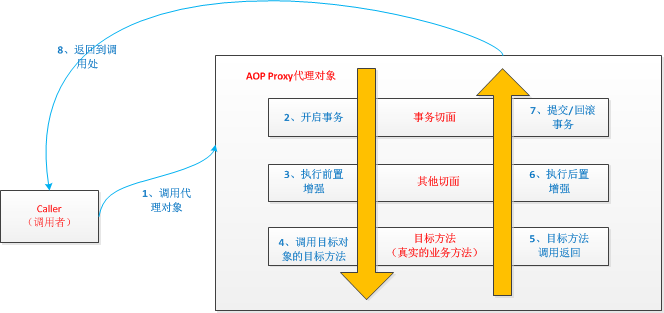

<!-- TOC -->

- [SpringBoot](#springboot)
    - [介绍](#介绍)
    - [注解](#注解)
        - [Bean](#bean)
        - [Autowired](#autowired)
        - [configuration](#configuration)
        - [RequestBody](#requestbody)
        - [Value](#value)
        - [PostConstruct](#postconstruct)
        - [Transactional](#transactional)
            - [使用方法](#使用方法)
            - [属性](#属性)
            - [工作原理](#工作原理)
            - [注意事项](#注意事项)
            - [自我调用的问题](#自我调用的问题)
    - [SpringBoot引用外部配置文件](#springboot引用外部配置文件)
    - [部署到tomcat](#部署到tomcat)
    - [SpringBoot 跳过 maven Test](#springboot-跳过-maven-test)
- [Swagger](#swagger)
    - [SpringBoot项目添加Swagger支持](#springboot项目添加swagger支持)
    - [存在的问题](#存在的问题)
- [Mybatis](#mybatis)
    - [调用存储过程](#调用存储过程)
    - [SQLDate类型返回值](#sqldate类型返回值)
    - [待解决问题](#待解决问题)
- [分布式事务](#分布式事务)

<!-- /TOC -->

# SpringBoot
> 1. 官方文档: https://docs.spring.io/spring-boot/docs/current-SNAPSHOT/reference/htmlsingle/   
> 2. 本地jar源码 + github源码: https://github.com/spring-projects

## 介绍
1. Spring boot 会自动扫描 `@SpringBootApplication` 这个启动java文件当前目录及子目录下的所有包含`@Component/@Service`的类.
    - 因为springboot不会自动扫面其他模块中`@Component/@Service`注解的类, 可以使用 `@ComponentScan(basePackages = {"cn.wzs.test.*"})` 注解. 作用是扫描其他模块中的`@Component/@Service/@Controller` 等bean.
    - 参考: https://www.zhihu.com/question/53376214
2. controller 常用注解: `@Controller, @RequestMapping, @ResponseBody, @RequestBody`
3. [redis操作](https://www.cnblogs.com/EasonJim/p/7803067.html)

## 注解
1. `@Component,@Service,@Controller,@Repository` 注解的类, 并把这些类纳入进spring容器中管理
2. `@Controller`: 被@Controller标注的类/方法 会添加到 处理传入的web请求 的策略中
    - 通俗讲就是标记为 controller(处理监听到的信息)
3. `@RequestMapping(value = "/",method="RequestMethod.GET")`: 提供"路由"的信息

### Bean
1. @Bean: 被注解标注的方法可以创建一个Bean并且交给Spring容器管理.
    - 参考: https://www.cnblogs.com/bossen/p/5824067.html

### Autowired
1. `@Autowired`: Spring会根据被标注的类, 自动创建相应的对象(被标注的累需要符合bean规范)(免除了手动new对象的过程)
    - @Autowired默认先按byType, 如果发现找到多个bean, 则按照byName方式比对, 如果还有多个, 则报出异常. 
    ```Java
    @Autowired
    private Car redCar;
    // spring先找类型为Car的bean
    // 如果存在且唯一, 则OK；
    // 如果不唯一, 在结果集里, 寻找name为redCar的bean. 因为bean的name有唯一性, 所以, 到这里应该能确定是否存在满足要求的bean了
    ```
    
### configuration
1. `@configuration`: @Configuration标注在类上, 相当于把该类作为spring的xml配置文件中的`<beans>`, 作用： 配置spring容器(应用上下文)
    - http://blog.csdn.net/javaloveiphone/article/details/52182899

### RequestBody
1. `@RequestBody`: 将Controller的方法参数, 根据HTTP Request Header的content-Type的内容,通过适当的HttpMessageConverter转换为JAVA类
    ```Java
    @RequestMapping(value = "/test", method= RequestMethod.POST)
    @ResponseBody
    public Person test(@RequestBody Person p) {
        return p;
    }
    // 请求request
    // data: '{"name":"ww","age":22}', # key值使用双引号
    // contentType: "application/json;charset=utf-8", # 根据data的格式指定Type值(Json/String/..)
    // type: "POST",
    ```

### Value
1. `@Value`: 获取配置文件中字段的值
    ```Java
    @Component      // 必须有这个注解,否则该类不会纳入Spring boot的容器管理
    public class KafkaConsumer {
        @Value("${kafka.size}")     // 获取配置文件的方式
        public Long size;
    }
    @PostConstruct      // 该注解表明该方法会在bean初始化后调用, (当bean没有初始化就调用方法时添加)
    public void test(){
        System.out.println(this.size)
    }
    ```
### PostConstruct
1. `@PostConstruct` 注释用于在依赖关系注入完成之后需要执行的方法上, 以执行任何初始化.(@PostConstruct注释的方法在构造方法之后, init方法之前进行调用)
    - 该方法不得有任何参数, 除非是在 EJB 拦截器(interceptor)的情况下, 根据 EJB 规范的定义, 在这种情况下它将带有一个 InvocationContext 对象
    - 该方法的返回类型必须为 void
    - 该方法不得抛出已检查异常
    - 应用 PostConstruct 的方法可以是 public、protected、package private 或 private
    - 除了应用程序客户端之外, 该方法不能是 static
    - 该方法可以是 final
    - 如果该方法抛出未检查异常, 那么不得将类放入服务中, 除非是能够处理异常并可从中恢复的 EJB

### Transactional
> 参考: [Spring @Transactional原理及使用](http://tech.lede.com/2017/02/06/rd/server/SpringTransactional/)
1. `@Transactional`: Spring 声明式事务
#### 使用方法
1. 标注在类前：标示类中所有方法都进行事务处理
2. 标注在接口、实现类的方法前：标示方法进行事务处理
#### 属性
| 属性          | 说明
|:--------------|:-------------
|name           |	当在配置文件中有多个 TransactionManager , 可以用该属性指定选择哪个事务管理器.
|propagation    |	事务的传播行为, 默认值为 REQUIRED. 参考 [事务传播行为](/Database/SQL.md#事务传播行为))
|isolation      |	事务的隔离度, 默认值采用 DEFAULT. (参考 [事务隔离级别](/Database/SQL.md#事务隔离级别))
|timeout        |	事务的超时时间, 默认值为-1.如果超过该时间限制但事务还没有完成, 则自动回滚事务.
|read-only      |	指定事务是否为只读事务, 默认值为 false；为了忽略那些不需要事务的方| 法, 比如读取数据, 可以设置 read-only 为 true.
|rollback-for   |	用于指定能够触发事务回滚的异常类型, 如果有多个异常类型需要指| 定, 各类型之间可以通过逗号分隔.
|no-rollback-for|	抛出 no-rollback-for 指定的异常类型, 不回滚事务.
#### 工作原理
1. 自动提交
    - 默认情况下, 数据库处于自动提交模式; 即每一条语句处于一个单独的事务中, 在这条语句执行完毕时, 如果执行成功则隐式的提交事务, 如果执行失败则隐式的回滚事务.
    - 事务管理, 是一组相关的操作处于一个事务之中, 因此需要关闭数据库的自动提交模式. Spring通过在`org/springframework/jdbc/datasource/DataSourceTransactionManager.java` 中将底层连接的自动提交特性设置为false实现事务管理.
2. spring事务回滚规则
    - Spring事务管理器回滚一个事务的推荐方法是在当前事务的上下文内抛出异常.Spring事务管理器会捕捉任何未处理的异常, 然后依据规则决定是否回滚抛出异常的事务.
    - 默认配置下, Spring只有在抛出的异常为运行时unchecked异常(即没被处理过的异常)时才回滚该事务, 也就是抛出的异常为RuntimeException的子类(Errors也会导致事务回滚).而抛出checked异常则不会导致事务回滚.
    - Spring也支持明确的配置在抛出哪些异常时回滚事务, 包括checked异常.也可以明确定义哪些异常抛出时不回滚事务. 还可以通过自定义`setRollbackOnly()`方法来指示一个事务必须回滚, 在调用完`setRollbackOnly()`后执行回滚.
#### 注意事项
1. `@Transactional` 只能应用到 public 方法: 因为Spring事务管理是基于接口代理或动态字节码技术, 通过AOP实施事务增强的.
    - 对于基于接口动态代理的AOP事务增强来说, 由于接口的方法是public的, 这就要求实现类的实现方法必须是public的(不能是protected, private等), 同时不能使用static的修饰符.所以, 可以实施接口动态代理的方法只能是使用"public"或"public final"修饰符的方法, 其它方法不可能被动态代理, 相应的也就不能实施AOP增强, 也即不能进行Spring事务增强.
    - 基于CGLib字节码动态代理的方案是通过扩展被增强类, 动态创建子类的方式进行AOP增强植入的.由于使用final,static,private修饰符的方法都不能被子类覆盖, 相应的, 这些方法将不能被实施的AOP增强.
2. 默认情况下只有遇到 unchecked(没有捕获) RuntimeException 异常才会回滚. checked和Exception都不会导致回滚.
    - 若要想所有异常都回滚: `@Transactional( rollbackFor=Exception.class)`
    - 若要想部分异常不回滚: `@Transactional(notRollbackFor=RunTimeException.class)`
3. 仅仅 @Transactional注解的出现不足于开启事务行为, 它仅仅是一种元数据, 能够被可以识别 @Transactional注解和上述的配置适当的具有事务行为的beans所使用.其实, 根本上是 元素的出现 开启了事务行为.
    - 建议是在具体的类(或类的方法)上使用 `@Transactional` 注解, 不在类所要实现的任何接口上使用注解. 
        - 因为注解是不能继承的, 所以在接口上使用注解时, 只能当同时设置了基于接口的代理时它才生效. 即 如果你正在使用基于类的代理时, 那么事务的设置将不能被基于类的代理所识别, 而且对象也将不会被事务代理所包装. *目前还不太了解这个是什么意思,等以后遇到了再看吧*
    - @Transactional 注解标识的方法, 处理过程尽量的简单.尤其是带锁的事务方法, 能不放在事务里面的最好不要放在事务里面.可以将常规的数据库查询操作放在事务前面进行, 而事务内进行增、删、改、加锁查询等操作.
    - `@Transactional` 注解的默认事务管理器bean是`transactionManager`, 如果声明为其他名称的事务管理器, 需要在方法上添加`@Transational("managerName")`指定`transactionManager`.
    - `@Transactional` 注解标注的方法中不要出现网络调用、比较耗时的处理程序, 因为事务中数据库连接是不会释放的, 如果每个事务的处理时间都非常长, 那么数据库连接资源将很快被耗尽.
#### 自我调用的问题
> *目前还不太了解这个是什么意思,等以后遇到了再看吧, 详细看开头的参考文档*
1. Spring事务使用AOP代理后的方法调用执行流程如下图: 
2. 从图中可以看出, 调用事务时首先调用的是AOP代理对象而不是目标对象, 首先执行事务切面, 事务切面内部通过TransactionInterceptor环绕增强进行事务的增强.即进入目标方法之前开启事务, 退出目标方法时提交/回滚事务.

## SpringBoot引用外部配置文件
1. Spring boot 默认将配置文件打包到jar中. 可以通过以下四种方式将配置文件放到外部(优先级依次降低)
    - 在jar包的同一目录下建一个config文件夹, 然后把配置文件放到这个文件夹下
    - 直接把配置文件放到jar包的同级目录
    - 在classpath下建一个config文件夹, 然后把配置文件放进去
    - 在classpath下直接放配置文件
    - 参考: http://blog.csdn.net/qq_35981283/article/details/77583073

## 部署到tomcat
1. pom.xml里设置 `<packaging>war</packaging>`
2. 移除 Spring Boot 自带的tomcat插件
    ```xml
    <dependency>
        <groupId>org.springframework.boot</groupId>
        <artifactId>spring-boot-starter-web</artifactId>
        <!-- 移除嵌入式tomcat插件 -->
        <exclusions>
            <exclusion>
                <groupId>org.springframework.boot</groupId>
                <artifactId>spring-boot-starter-tomcat</artifactId>
            </exclusion>
        </exclusions>
    </dependency>
    ```
3. 添加`servlet-api`依赖
    ```xml
    <dependency>
        <groupId>javax.servlet</groupId>
        <artifactId>javax.servlet-api</artifactId>
        <version>3.1.0</version>
        <scope>provided</scope>
    </dependency>
    ```
4. 修改启动类, 并重写初始化方法
    ```Java
    /**
    * 修改启动类, 继承 SpringBootServletInitializer 并重写 configure 方法
    */
    public class SpringBootStartApplication extends SpringBootServletInitializer {

        @Override
        protected SpringApplicationBuilder configure(SpringApplicationBuilder builder) {
            // 注意这里要指向原先用main方法执行的Application启动类
            return builder.sources(Application.class);
        }
    }
    ```

## SpringBoot 跳过 maven Test
```xml
<build>
    <plugins>
        <plugin>
            <groupId>org.apache.maven.plugins</groupId>
            <artifactId>maven-surefire-plugin</artifactId>
            <version>2.12.4</version>
            <configuration>
                <skipTests>true</skipTests>
            </configuration>
        </plugin>
    </plugins>
</build>
```

# Swagger
> https://www.gitbook.com/book/huangwenchao/swagger/details

## SpringBoot项目添加Swagger支持
1. 在pom中添加依赖
    ```xml
    <dependency>
        <groupId>io.springfox</groupId>
        <artifactId>springfox-swagger2</artifactId>
        <version>2.2.2</version>
    </dependency>
    <dependency>
        <groupId>io.springfox</groupId>
        <artifactId>springfox-swagger-ui</artifactId>
        <version>2.2.2</version>
    </dependency>
    ```
2. 创建 Swagger2 配置类
    ```Java
    @Configuration
    @EnableSwagger2
    public class SwaggerConfig {

    /**
     * Api docket.
     *
     * @return the docket
     */
    @Bean
    public Docket api() {
        return new Docket(DocumentationType.SWAGGER_2)
            .select()
            .apis(RequestHandlerSelectors.withClassAnnotation(Api.class))
            .paths(PathSelectors.any())
            .build()
            .directModelSubstitute(LocalDate.class, String.class)
            .useDefaultResponseMessages(false)
            .apiInfo(apiInfo())
            ;
    }

    /**
     * api info
     *
     * @return ApiInfo
     */
    private ApiInfo apiInfo() {
        return new ApiInfoBuilder()
            .title("平台 API 文档")
            .build();

    }
    ```
3. 添加文档内容
    ```Java
    @PostMapping(value = "/test", produces = "application/json; charset=UTF-8")
    @ApiOperation(value = "测试")
    // token认证
    @ApiImplicitParams({@ApiImplicitParam(name = "Authorization", required = true, paramType = "header", dataType = "string", value = "authorization header", defaultValue = "Bearer ")})
    public ResultMap test(@ApiParam(required = true, value = "版本", defaultValue = "v1")@PathVariable("version") String version) {
        return null;
    }
    ```

## 存在的问题
1. 在 swagger-ui 页面请求API测试时, 偶尔会出现一次点击, 多次请求的情况. 此时可以打开 浏览器的调试功能监控,看下(不常复现)
    - [Regression for Top-Level Objects Resolution](https://github.com/swagger-api/swagger-js/issues/489)
    - [Multiple XHR requests for the same api-docs](https://github.com/swagger-api/swagger-ui/issues/1492)


# Mybatis

1. mybatis的所有查询, 都必须返回resultType或者resultMap的值.否则会报错

## 调用存储过程
> 参考: https://www.jianshu.com/p/dd30aa0acd2f
1. TestMapper.java
    ```Java
    public int getUserCount(Map query)
    ```
2. TestMapper.xml
    ```xml
    <select id="getUserCount" parameterMap="getUserCountMap" statementType="CALLABLE">
        CALL mybatis.ges_user_count(?,?)
    </select>

    <parameterMap id="getUserCountMap" type="java.util.Map">
        <parameter property="sexid" mode="IN" jdbcType="INTEGER"/>
        <parameter property="usercount" mode="OUT" jdbcType="INTEGER"/>
    </parameterMap>

    <!-- 或者 -->
    <select id="getUserCount" parameterType="java.util.Map" statementType="CALLABLE" resultType="java.lang.Integer">
        {
            CALL mybatis.ges_user_count(
                #{sexid, mode=IN, jdbcType=INTEGER},
                #{usercount, mode=OUT, jdbcType=INTEGER}
            )
        }
    </select>
    ```
3. 在 mybatis 中, 存储过程的返回值 会自动添加到 mapper.java 文件-相应方法中的 map 中
    - 在本例中, 存储过程的返回值 可以从 `TestMapper.java`接口中的 `getUserCount()` 方法的 `query` 变量中取出
    - 参考: https://blog.csdn.net/liubo2012/article/details/8230138
    - 唠叨: 在分布式应用框架中, 记得 复制 query 的值返回, 毕竟两个进程中就算是引用类型, 内存地址也不一样.. 毕竟两个进程...(虽然说这个很low  但是今天我被这个坑了..)
4. 注意事项
    - 当mode为OUT或INOUT时必须同时指定jdbcType

## SQLDate类型返回值
> SQLDate类型返回值会自动转换为时间戳, 修改为常用格式

在 实体类中, Date字段的get方法前加以下注解即可
```Java
private Date start_time;
@JsonFormat(pattern="yyyy-MM-dd HH:mm:ss",timezone = "GMT+8")
public Date getStart_time() {
    return start_time;
}

public void setStart_time(Date start_time) {
    this.start_time = start_time;
}
```

## 待解决问题
1. Mybatis 里添加注释后, 执行会报错. 需要去掉注释才行
    - 参考： https://blog.csdn.net/beagreatprogrammer/article/details/79262532
    ```xml
        <select id="getDepositOrderDetail" parameterType="java.lang.String" statementType="CALLABLE" resultType="java.util.Map">
        --        select orderNum,payWay from kh_user_bills
        -- 	      where createUser=#{userId}
        -- 		  and changesType=7 and state=1
        --           and updateTime > (select updateTime from kh_user_bills
        -- 			  where createUser=#{userId} and changesType=11 and state=1
        --               order by updateTime desc limit 1)
        --           order by updateTime desc limit 1
        {
          call getDepositOrderDetail(
          #{userId, mode=IN, jdbcType=VARCHAR}
          )
        }
    </select>
    ```

# 分布式事务
> https://www.zhihu.com/question/29483490
> https://www.aliyun.com/aliware/txc?spm=5176.8142029.388261.386.e93976f4FpDf6I
