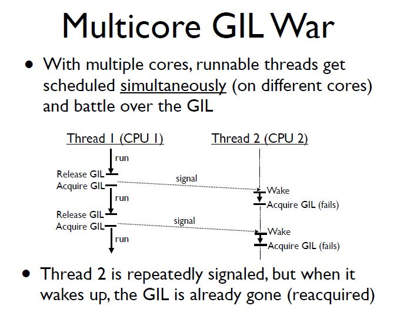

<!-- TOC -->

- [多进程和多线程](#多进程和多线程)
    - [线程颠簸](#线程颠簸)
- [GIL介绍](#gil介绍)
    - [Python3改进](#python3改进)

<!-- /TOC -->

- [线程和进程](/Program/TechArticle/ThreadAndProcess.md)
- [代码示例](/Lib/ThreadAndProcess.py)
- 参考: [python并发编程二三事(二)](https://izsk.me/2017/02/11/python并发编程二三事(二)/)

## 多进程和多线程
1. python由于有GIL锁的存在, 所以
    - CPU密集型程序 使用 多进程 比较合适
    - IO密集型程序 使用 多线程 比较合适
2. 优先使用线程池/进程池, 其次推荐使用 `concurrent.futures`
    - Python3 自带 `concurrent.futures`, Python2 需要安装: `pip install futures`
3. 问题
    - 有时间研究下 源码: 进程创建是如何实现的(如何与底层交互), 如何异步判断进程执行完毕的.

### 线程颠簸
> 参考: http://www.dabeaz.com/python/UnderstandingGIL.pdf
1. Python 在多核多线程下执行效率不如单核多线程. 原因参考如下:
    - 
    - 多核情况下, CPU1上的thread1运行完之后释放GIL, 而后引起操作系统调度(按照Python社区的想法, 操作系统本身的线程调度已经非常成熟稳定了, 没有必要自己搞一套, 所以可以粗略看成python的调度是依靠操作系统), 此时唤醒CPU2上的thread2, 但GIL可能会马上又被CPU1拿到, 导致CPU2上被唤醒后的线程thread2醒着等待到切换时间后因为没有GIL又进入待调度状态, 这就是线程颠簸(thrashing), 每次释放GIL锁, 线程进行锁竞争,切换线程, 上下文切换都会消耗资源, 所以说CPU密集型多核CPU下thread效率很差.

## GIL介绍
> 参考: [GIL_Python2.7文档](http://tool.oschina.net/uploads/apidocs/python2.7.3/c-api/init.html?highlight=gil#thread-state-and-the-global-interpreter-lock)

1. Global Interpreter Lock(全局解释器锁)
2. Python代码的执行由 Python 虚拟机(也叫解释器主循环, CPython版本)来控制, Python 在设计之初就考虑到要在解释器的主循环中, 在同一个进程内, 同时只有一个线程在执行, 即在任意时刻, 只有一个线程在解释器中运行. 对Python 虚拟机的访问由GIL来控制, 正是这个锁能保证同一时刻只有一个线程在运行. 
    1. 设置GIL
    2. 切换到一个线程去运行
    3. 运行：
        - 指定数量的字节码指令(GIL的释放逻辑是当前线程遇见IO操作或者ticks计数达到100时释放(ticks可以看作是python自身的一个CPU时钟计数器, 专门做用于GIL, 每次释放后归零, 这个计数可以通过 `sys.setcheckinterval 来调整`))
        - 或者：线程主动让出资源(程序调用`time.sleep()`,IO操作等 即视为线程让出资源)
    4. 解锁GIL
    5. 重复
3. Python每个进程都有各自独立的GIL,所以多进程内是互不干扰的.
4. 从GIL的介绍中可知
    - 对CPU密集程序不友好: 由于Python2使用ticks控制GIL, 但是CPU密集程序很快会跑满ticks 从而导致GIL释放, 导致多个线程来回切换消耗资源
    - 对IO密集型友好: 当线程进行 文件IO, 网络IO操作等IO操作时, GIL释放切换到其他线程执行, 从而不浪费CPU资源(大多数IO操作比程序执行费时,所以认为CPU资源是宝贵的,要优先保证CPU的使用被占满)

### Python3改进
1. 在python3.x中, GIL不使用ticks计数, 改为使用计时器(执行时间达到阈值后, 当前线程释放GIL), 这样对CPU密集型程序更加友好, 但依然没有解决GIL导致的同一时间只能执行一个线程的问题
