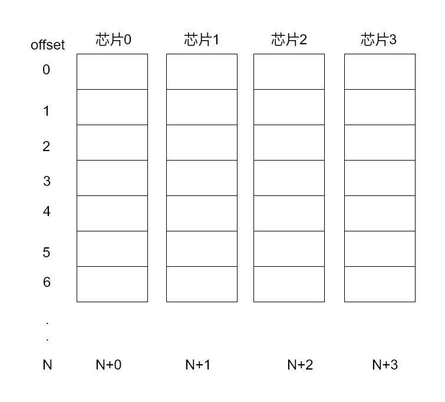

## 内存对齐
从问题开始

以C语言举例, 猜猜Test1和Test2的size是否相同, 如果不同, 各自是多大.
```C
struct Test1 {
	char c;
	int i;
	short s;
};
struct Test2 {
	int i;
    char c;
	short s;
};
func main(){
	var tt1 Test1
	var tt2 Test2
	fmt.Println(unsafe.Sizeof(tt1))
	fmt.Println(unsafe.Sizeof(tt2))
}
```

没想到吧... Test1的size==12, Test2的size==8. 为什么呢? 这就要涉及到内存对齐了. 而讲到内存对齐, 又得了解 CPU/内存 的部分构造和交互原理. 阅读下文逐渐了解. 这里先给内存对齐下一个定义: **内存对齐是为了CPU可以快速访问内存而采用的一种技术.**

> [以上部分参考: C++ 内存对齐](http://www.cnblogs.com/TenosDoIt/p/3590491.html)

### 内存对齐是什么
内存对齐是为了CPU可以快速访问内存而采用的一种技术.

为什么需要内存对齐
1. 部分CPU不支持非对齐访问(如arm的部分CPU)
2. 性能: 当访问未对齐的内存时, CPU **可能** 需要两次内存访问才能存取一个对象的值, 而对齐的内存只需要一次访问即可.
    - 需要知道, 内存访问速度是计算机整体速度的瓶颈(至少在现在/2018是), 内存访问时钟周期远小于CPU时钟周期.(感兴趣的同学可以计算下两者的频率); 所以减少内存访问的速度, 能有效地提升执行速度.
    - [参考: CPU的等待有多久](https://www.cnblogs.com/xkfz007/archive/2012/10/08/2715163.html)
    - 注意 *可能* 二字.

接下来讲讲为什么内存对齐可以提升性能(既为什么`CPU可能需要两次内存访问才能存取一个对象的值, 而对齐的内存只需要一次访问即可`). 至于最开始提的问题, 等解答完性能这个问题, 你就明白的差不多了.

首先需要了解内存对齐的规则, 以及CPU/内存相关的构造, 最后了解内存对齐如何提升性能的.

### 内存对齐的规则
具体而言, 内存对齐是指CPU对内存的对齐访问, 所谓对齐访问, 包括两个方面: 起始位置+对齐字节值.

起始位置规则如下: 如果 sizeof(type)==N, 那么起始位置要能被N整除.
- 当访问1byte的数据时, 起始位置要能被1整除(就是有空闲就可以放)
- 当访问2byte的数据时, 起始位置要能被2整除
- 当访问4byte的数据时, 起始位置要能被8整除

对齐字节值规则如下(C语言, Go也适用):
1. 数据成员对齐规则: 
    - 如果该成员是自带类型如int, char, double等, 那么 `内存对齐参数 = 该类型在内存中所占的字节数`
    - 如果该成员是自定义类型(如struct), 那么 `内存对齐参数 = 该类型内内存对齐参数最大的成员`
    - 如果自行设置了 内存对齐参数=i字节, 类中最大成员内存对齐参数为j, 那么 `内存对齐参数 = min(i, j)`
2. 整体对齐规则: 在数据成员完成各自对齐之后, 自定义类型(如struct)本身也要进行对齐. 整体内存对齐参数是 **内存对齐参数的k倍.**
    - 重点在 整体内存对齐参数的值, 而不是k的值. 之所以是k倍, 是因为结构体中类型数量和位置是不确定的, 所以k也是不确定的. 具体看后续介绍
3. 类中第一个数据成员放在offset为0的位置; 对于其他的数据成员(假设该数据成员内存对齐参数为k), 他们放置的起始位置offset应该是 `min(k,n)` 的整数倍

注意, 这里再次强调下内存对齐是为了保证CPU用最少的内存访问次数读取对象的值.

### CPU/内存相关构造
- 对于32位的CPU, 数据总线宽度为32, 拥有一次读取 32bit=4byte 数据的能力. 理论上CPU可以从任意内存地址连续读取4个连续字节, 不需要对齐.
    - 提示: 对于CPU, 如果数据总线是8位那么一次读取8bit, 如果数据总线是32位那么一次读取32bit.

- 一个内存条通常由多个内存芯片组成(通常是2的幂次方个内存芯片), 每个芯片数据的单位是8bit. 软件对内存的读写是以byte为单位的, 但是CPU对内存的读写是以偏移量/offset为单位的, 而且offset必须是4的倍数.
    - offset 是以byte为单位, 而不是bit.
    - [参考: 计算机原理学习（3）-- 内存工作原理](https://blog.csdn.net/cc_net/article/details/11097267)
    - _offset必须是4的倍数_ 参考链接中的 `3.1.3.2.1`

### 内存对齐如何提升性能
通过例子解释下为什么 _`CPU可能需要两次内存访问才能存取一个对象的值, 而对齐的内存只需要一次访问即可`_

假设有32位CPU, 4个内存芯片 A0-A3, 
- 假设要读取1byte的数据 `char类型`
    - 因为32位CPU数据总线是32位, 对不对齐都行, 一次32位放在哪都能读到
- 假设要读取2byte的数据 `int16类型`
    - 假设内存对齐: 只要 `startAddr%2==0` 即可. 如起始地址为 0x00, 那么16bit只需要从0x00连续读取16位即可.
    - 假设内存没有对齐
        - 如果 `startAddr/16<=1`, 既数据在同一offset内, 则一次读取也可以读出全部值
        - 如果 `startAddr/16>1`, 假设起始地址是0x18H(十进制24), 所以第一个字节存储在 offset为0的 A3, 最后一个字节存储在A0, 但是偏移量不同. 又因为offset只能是4的倍数, 所以第一次读取offset=0的 (A0-A3), 第二次读取 offset=1的 (A0-A3)', 然后拼接两段值得到2byte数据.
- 假设要读取4byte的数据 `int类型` (大体同上, 不再详细写)
    - 假设内存对齐: 起始地址为 0x00, 那么32bit只需要从0x00连续读取32位即可.
    - 假设内存没有对齐: 起始地址是0x01, 所以前三个字节存储在 offset为0的 A1-A3, 最后一个字节存储在A0, 但是偏移量不同. 又因为offset只能是4的倍数, 所以第一次读取offset=0的 (A0-A3), 第二次读取 offset=1的 (A0-A3)', 然后拼接两段值得到4byte数据.
- 假设要读取 12byte 的结构体 a0-a11
    - 假设内存对齐: `startAddr%12==0`, 只需要三次内存访问, 就可以全部读取.
    - 假设内存不对齐: 
        - 假设 a0在offset=0的A3位置, 类推a9-a11在offset=2的A1-A3, 所以需要四次内存访问才可以读取全部数据.

到此处, 已经证明 内存对齐确实可以实现 _`CPU可能需要两次内存访问才能存取一个对象的值, 而对齐的内存只需要一次访问即可`_, 并且提升了性能(虽然浪费了部分内存空间).

然后, 还有几个问题没有说明
1. 对齐规则中, 为什么起始位置要能被N整除?
    - 在如上, 假设读取4byte数据时已经说明了这个问题. 如果起始位置不能被4整除, 那么依然需要两次内存访问.
2. k值如何确定
    - 根据 结构体中类型数量和位置, 按照内存对齐的规则, 依次分配内存. 最后改结构体占用的空间大小就是整体内存对齐参数的值.
    - 参见示例[最初的问题](#最初的问题)
3. 对齐规则中, 整体内存对齐参数为什么是这个值?
    - 在如上, 假设读取12byte数据时已经说明了这个问题. 如果起始位置不能被12整除, 那么依然需要两次内存访问.

### 最初的问题
最后, 讲讲刚开始提出的例子, 对于Test1
```C
struct Test1 {
	char c;
	int i;
	short s;
};
```
char 占用1字节, int 占用4字节, short占用2字节, Test1却占用12字节. 原因如下:
- 分配器按照顺序分配内存, 内存对齐参数=4
    - char分配1字节; char在A0, A1-A3空闲
    - int分配4字节, 因为offset=0只有 A1-A3空闲, 小于内存对齐参数, 所以int分配到offset=1,
    - short分配2字节, offset=1没有空闲, short占用 [A0-A1],[A2-A3]空闲.
- 所以, Test1 占用12个字节. 

```C
struct Test2 {
    int i;
	char c;
	short s;
};
```
char 占用1字节, int 占用4字节, short占用2字节, Test1却占用12字节. 原因如下:
- 分配器按照顺序分配内存, 内存对齐参数=4
    - int分配4字节, 因为offset=0有四个空闲byte, 且不小于内存对齐参数=4; 所以int分配到offset=0的 [A0-A3]
    - char分配1字节; char在offset=1的A0, A1-A3空闲
    - short分配2字节, offset=1有三个空闲, short的内存对齐参数=2; 所以short起始地址为A2(起始地址要能被2整除), 占用 [A2-A3].
- 所以, Test2 占用8个字节.

### 引用
- [计算机原理学习（3）-- 内存工作原理](https://blog.csdn.net/cc_net/article/details/11097267)
- [浅谈CPU内存访问要求对齐的原因](https://yangwang.hk/?p=773)
- [C++ 内存对齐](http://www.cnblogs.com/TenosDoIt/p/3590491.html)
- [什么是 Memory Alignment 内存对齐](https://www.oschina.net/question/4873_14304)