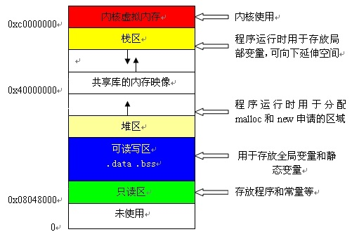

# 内存分配

> 基于C语言, C#/JAVA 中已经封装了很多, 不太能看到底层.   
> C# 中, 类型分为值类型(存储在栈)和引用类型(地址存储在栈中, 内容存储到堆)  
> C# 中, 需要程序员回收的有：流对象(FileStream等); 而其他不管是堆还是栈都是有垃圾回收机制回收的. 
> 想要了解更多,  可以看下 编译原理 相关的知识


内存分配是了解程序运行的根本之一. 理解好内存分配和逻辑处理非常有助于程序优化和深层理解. 
GET到的新技能
1. 通过看汇编语言指令的条数和效率判断程序代码段效率
2. 程序放在代码段中. （可读可执行不可写）
3. 指针都是12Byte
4. 内存分配的方式 
5. 堆栈分配的区别：管理, 分配, 大小


首先, 来张表示 内存分配 的图. 
1. 从上到下依次为: 
    - 栈
    - 数据段: 堆, BSS(未初始化的静态/全局数据),非零数据(初始化的静态/全局数据)
2. 栈从高位开始, 向下增长; 堆则是向上增长



示例代码：
````
int a = 0; //全局初始化区 
char *p1; //全局未初始化区 
main() 
{ 
    int b; //栈 
    char s[] = "abc"; //栈 
    char *p2; //栈 
    char *p3 = "123456"; //123456\0在常量区, p3在栈上.  
    static int c =0； //全局（静态）初始化区 
    p1 = (char *)malloc(10); //堆 
    p2 = (char *)malloc(20);  //堆 
}
````

栈和堆内存分配区别
1. 内存管理 : 申请方式和回收方式
    1. 栈（英文名称是stack）是系统自动分配空间的,而堆（英文名称是heap）则是程序员根据需要自己申请的空间
    2. 栈上的空间是自动分配自动回收的, 堆的需要程序员去释放
2. 分配方式 : 申请时系统的响应
	1. 栈：只要栈的剩余空间大于所申请空间, 系统将为程序提供内存, 否则将报异常提示栈溢出. 
	2. 堆：首先应该知道操作系统有一个记录空闲内存地址的链表, 当系统收到程序的申请时, 会遍历该链表, 寻找第一个空间大于所申请空间的堆结点, 然后将该结点从空闲结点链表中删除, 并将该结点的空间分配给程序, 另外, 对于大多数系统, 会在这块内存空间中的首地址处记录本次分配的大小, 这样, 代码中的 delete语句才能正确的释放本内存空间. 另外, 由于找到的堆结点的大小不一定正好等于申请的大小, 系统会自动的将多余的那部分重新放入空闲链表中.  
3. 申请大小的限制
	1. 栈：在Windows下,栈是向低地址扩展的数据结构, 是一块连续的内存的区域. 这句话的意思是栈顶的地址和栈的最大容量是系统预先规定好的, 在 WINDOWS下, 栈的大小是2M（也有的说是1M, 总之是一个编译时就确定的常数）, 如果申请的空间超过栈的剩余空间时, 将提示overflow. 因此, 能从栈获得的空间较小.  
	2. 堆：堆是向高地址扩展的数据结构, 是不连续的内存区域. 这是由于系统是用链表来存储的空闲内存地址的, 自然是不连续的, 而链表的遍历方向是由低地址向高地址. 堆的大小受限于计算机系统中有效的虚拟内存. 由此可见, 堆获得的空间比较灵活, 也比较大. 
4. 戏称：
	1. 使用栈就象我们去饭馆里吃饭, 只管点菜（发出申请）、付钱、和吃（使用）, 吃饱了就走, 不必理会切菜、洗菜等准备工作和洗碗、刷锅等扫尾工作, 他的好处是快捷, 但是自由度小.  
	2. 使用堆就象是自己动手做喜欢吃的菜肴, 比较麻烦, 但是比较符合自己的口味, 而且自由度大. 比喻很形象, 说的很通俗易懂, 不知道你是否有点收获. 

### 程序中的使用
_以下内容为推测_
1. 构造函数
    - 构造函数并不分配内存空间, 一般都是由底层通过 malloc 函数开辟出一块内存, 然后构造函数在此内存上构造对象. 
    - new 一般是通过malloc开辟内存然后在此块内存空间上调用对象的构造函数
1. Python 中的 `__new__` 函数 负责创建一个新的实例, 但是初始化是交给 `__init__` 函数完后才能的, 所以`__new__`函数的底层应该与malloc相关. 而 new和init两个函数实现了构造函数的功能(分开是为了简单化)

# ETC
1. [C语言中内存堆和栈的区别](http://www.cnblogs.com/myblesh/archive/2012/03/14/2396409.html)