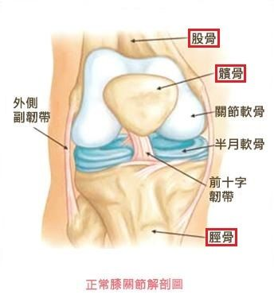

## 自行车选择
<!-- TOC -->

- [自行车选择](#自行车选择)
    - [入门: 山地车/公路车方向选择](#入门-山地车公路车方向选择)
    - [车辆介绍](#车辆介绍)
        - [刹车系统](#刹车系统)
    - [装备](#装备)
        - [骑行眼镜](#骑行眼镜)
        - [护膝/膝套](#护膝膝套)
    - [参考](#参考)

<!-- /TOC -->

首先讲下骑行的好处与坏处, 以及与其他运动方式的对比(这里主要讲 骑行/游泳/跑步, 健身就不说了)
1. 骑行: 
    - 好处: 除了常规的健身之外, 骑行主要锻炼腿部, 提升心肺功能, 且可以塑身(大腿部肌肉以及翘臀).
    - 坏处: 对于男性而言, 骑行一般会压迫前列腺, 导致前列腺炎等.(注意了哈, 要选个好车座). 另外, 如果骑行姿势不对, 会损耗膝盖. 
2. 跑步: 跑步可以提高耐力, 且既可以锻炼上身, 也可以锻炼下身. 但是姿势不对时对膝盖损伤比较大.
3. 游泳: 游泳可以锻炼全身.
    - 缺点就是对设施要求比较高(硬性, 必须要有游泳池), 水不干净的话可能感染结膜炎 支原体感染; 姿势方面, 游泳太累伤肩膀 换动作太快动作伤肌肉.
4. 对比
    - 此三种运动都是经典的有氧运动.
    - 三种运动中, 跑步散热最慢, 骑行次之(有风), 游泳散热最快. 散热部分影响运动的快感.

其实主要是看兴趣, 有兴趣才能坚持下来, 才能获得愉悦感. 如果单纯的想要保持健康, 锻炼身体, 还是去健身比较好.

### 入门: 山地车/公路车方向选择
自行车分 公路车/山地车 两个极限方向发展, 但是很多产品都是跨界的, 如公路越野车.

接下来讲下公路车与山地车设计上的区别:
- 公路车设计上主要是在铺设路面上行驶, 适合长途骑行, 健身, 以及速度竞赛玩家.
    - 长途骑行是指 100/200km/天, 结队出行可以减少风阻以及互相照顾.
- 山地车设计上一般偏向越野+特技+耐糙, 适合复杂路况行驶, 短途行驶, 以及特技玩家.
- 对比
    - 骑行姿势: 公路车把必须和肩等宽, 否则骑久了不利于背部健康和舒适; 公路车一般可以有多重抓把方式以满足不同情况下的需求和休息的需要, 山地车一般不考虑这个.
    - 公路车有为长途旅行设计的装备, 如锁鞋等, 山地车一般没有. 但是另一方面带来的就是, 公路车一般都比较贵, 而且比山地车更复杂.

入坑之前, 一定要分析清楚自己的需求, 根据自己的需求, 在 山地车-公路车 之间做权衡, 找到适合自己的种类.(不一定非是这两个极端, 也有很多跨界车可选)
- 如果路况很差(不是指堵车...是指道路很差, 崎岖不平或路况难以预料), 那么推荐山地车.
- 长途公路行驶, 那么肯定是公路车.
- 通勤车/买菜车有专门的类型, 参考 捷安特莫曼顿, 或者其他的助力车(其实就是权衡/取舍).

最后, 提示一下, 买车一定要买装备, 入坑需谨慎. 一般正式入门大概2w软妹币起烧, 而且需要一些专业的锻炼, 如锁鞋的使用, 以及如何抗摔打, 应对摔车出现的损伤.
- _正式入门大概2w软妹币起烧_ 是个人查阅的, 没有真正实践过. 一般车要1.5w左右, 再买些设备就差不多了(头盔 眼镜 锁鞋 骑行裤等).

### 车辆介绍
以 捷安特 举例.

车型分类如下
- TCR: 爬坡综合型, 综合型公路车, 压缩车架. 可用于 丘陵地或高山路线的骑行, 可挑战连续的爬坡路况. 定位介于 DEFY与Propel 之间(其实更偏向Propel).
- DEFY: 长程古典型, 主要针对长距离的骑行, 与TCR相比提升了减震. 适用于接近200km或以上的全天候路况,环路或颠簸的石板路骑行.
- Propel: 空气动力学型, 主要针对风阻进行优化, 提升骑行速度为主, 主攻平路和冲刺.
- trinity: 铁人三项专用类型, 铁三车, 具体指铁人三项中的自行车运动使用的车.(铁人三项是指运动员一次完成 水域-骑车-长跑 三项运动)
- TCX: 越野公路车架, 主要用于泥泞路面的公路越野.
- TCR/DEFY比较: TCR反应灵敏且轻快, defy舒适性好(并不代表defy反应不灵敏, 只是这两类对比而言). TCR使用的压缩车架.
    - DEFY使用的经典车架, 上管长度较短, 立管长度较长, 车子重心偏高, 所以骑车时重心靠前, 相对骑乘姿势腰部位置较高.
        - 优点: 对路面震动的感受和传达较不灵敏, 长时间骑乘舒适性较佳.
        - 缺点: 车架制造上需要压缩车架两倍以上的尺寸, 下车容易卡蛋..
    - TCR使用的压缩车架, 上管长度较长, 立管长度较短, 车子重心较低. 所以骑乘时, 重心会较往后, 骑乘姿势背部及腰部的曲线较平缓
        - 优点: 车辆轻, 下车不容易卡蛋..
        - 缺点: 路感较明显, 长时间骑乘相对疲劳程度较高.
    
然后了解下车辆套件的级别
- [SHIMANO套件 从入门到精通](http://www.bicyclew.com/qixingzhuangbei/read-4-7102-4.html)
    
深入了解可以看下 GCN(gloabl cycle network) 的视频(需要翻墙), 也可以在B站看(部分)

#### 刹车系统
- [山地车V刹、机械碟刹与油压碟刹的性能与区别介绍](http://www.biketo.com/knowledge/9400.html)

### 装备
省钱推荐迪卡侬, 户外装备的优衣库.

- [参考: 骑行装备清单](https://zhuanlan.zhihu.com/p/44540316)

列表如下:

必买:
1. 头盔:  迪卡侬(300RMB), 如有更高要求可选 kask mojito(1300RMB)
2. 骑行服: 暂时先不用(主要是骑行裤)
3. 眼镜: oakley radar ev OO927 黑色(1500RMB)
4. 手套: 迪卡侬, 全指/半指根据情况筛选(100RMB)
5. 码表: 佳名130(1000RMB)

推荐:
10. 车灯: 先不买
11. 水壶: 先不买
12. 背包/驼包+尾架: 暂时先用timbuk,有需要再换

可选:
100. 挡泥板: 不买. 城市短途骑行才比较需要, 长途骑行用处不大且不安全(多增加了一个尖锐物品)

修车装备: ...

#### 骑行眼镜
不差钱上 oakley.

- [如何来正确地选择骑行眼镜](http://www.biketo.com/knowledge/9222_1.html)

骑行眼镜功能: 太阳镜+防风+摔倒保护. 太阳镜主要是遮挡紫外线,以及其他作用. 好的眼镜更清晰.

根据光线情况选择合适的镜片颜色:
1. 黑色: 极强光, 如中午光
2. 蓝色: 能见度低的天气, 如雾天.
3. 黄色: 傍晚等弱光情况, 提升清晰度.(其实可以用路灯/车灯替代)
4. 透明: 遮风挡雨
5. 镀硌: 高原/雪地/强紫外线

#### 护膝/膝套
- [参考:护膝有什么用_知乎](https://www.zhihu.com/question/54455269)
- [膝盖结构与原理](https://zhuanlan.zhihu.com/p/31490366)

在户外运动中, 因膝盖比较脆弱且不易回复, 发烧友需要配备相应护膝装备.

膝关节主要由 骨头(股骨/胫骨/髌骨)/韧带/半月板/肌肉 组成, 图示如下 
1. 韧带拉动骨头完成弯曲/伸直动作
2. 半月板可帮助力量的传递, 减少股骨和胫骨间的接触压力, 帮助润滑及软骨的营养供应

护膝常用在 登山/跑步/球类 等运动中, 护膝的主要作用是:
1. 运动保护: 减少碰撞等带来的伤害
    - 滑雪/轮滑等运动中, 使用硬护膝以减少碰撞伤害.
2. 保暖/防晒: 根据材料/透气等不同, 可以在保暖/防晒之间做取舍.(防晒用于替代防晒霜+一定保护)
    - 虽然腿部肌肉很多, 但是膝盖处几乎没有肌肉, 所以膝盖处容易着凉.
    - 保暖: 膝盖长期受凉会导致膝关节免疫异常, 从而出现关节疼痛/老寒腿: 免疫细胞将自身细胞识别为侵入者, 对其进行攻击.
3. 关节保护:
    - 支撑作用: 膝关节(半月板,胫骨)承担了腿部大部分压力(包括自身重力), 支撑部分将压力转换到其他部位(如大小腿肌肉).
    - 制动作用: 当腿部作出大幅度动作时, 可能导致髌骨移位或韧带拉伤. 部分护膝带有弹簧支撑(如 LP733), 用于减少膝盖的弯曲程度,并在还原时提供一定的辅助力量, 使大小腿维持在一条直线上.

哪些人需要使用护膝
1. 登山/跑步/负重徒步: 需要带 支撑/制动 的护膝(参考LP733).
    - 跑步百利, 唯有伤膝. 跑步一定要佩戴护膝
2. 骑行: 不需要制动/支撑作用!! 注意保暖性以及贴身设计(减少风阻)
3. 轮滑: 硬护膝.
4. 已有膝盖损伤: 请去医院检查并听从相应建议.
5. 正常生活: 不需要护膝, 注意保暖即可.

骑行运动中, 保护膝盖一般分以下方面
1. 热身: 骑行前注意对膝盖热身(参见keep, 简单的側蹲也可)
    - [下肢热身](https://www.zhihu.com/question/37560656)
2. 骑行姿势:
    - 高转速: 使用高频踏时, 每次蹬踏时膝盖的受力将会被减轻
    - 调整坐垫: 蹬到底时, 腿几乎蹬直. (减少膝盖弯曲程度)
    - [长途骑行如何戴护膝](https://zhuanlan.zhihu.com/p/22941867)
3. 保暖: 由于膝盖自身不会随着运动发热, 且骑行过程中风会带走更多热量, 所以膝盖保暖是很有必要的
4. 附加作用:
    - 贴身: 减少骑行时带来的阻力.
    - 防晒
    - 骑行服+骑行手套基本可以做到软壳护膝的效果, 硬壳护膝根据情况选用(山地车特技运动等山区骑车需要)

装备推荐
1. [护膝分类](https://www.zhihu.com/question/21638726/answer/22558897)
    - 因为骑行不需要对此作出区分, 所以暂时不分析这个.
2. 品牌推荐: 据说 LP733(带制动)/LP788(不带制动) 不错. 没有深入研究.
3. 骑行袖套/膝套: 冬夏各一副
    - 夏季: 迪卡侬袖套/膝套即可.
    - 冬季: 一般不需要袖套/膝套, 依靠衣物保暖. 如果依旧感觉膝盖凉, 多穿衣服/买个保暖膝套(依旧迪卡侬..)
    - 因为 公路骑行(非山地等骑行) 的袖套/膝套主要用于保暖防晒, 技术含量不高, 没必要大牌, 迪卡侬就ok.(夏季注意看 UPF/透气性/是否舒适)

### 参考
- 介绍
    - [骑行有哪些好处和坏处](https://zhuanlan.zhihu.com/p/25705777)
    - [跑步 游泳和骑行, 同样强度哪个消耗更大](https://zhuanlan.zhihu.com/p/44727166)
- 如何选择
    - [山地车和公路车—关于公路车的五大误解](https://www.jianshu.com/p/WXHqas)
    - [公路車三大車系完全解析](http://www.cycling-update.info/activity/new-arrival/1203-2015-07-02-09-33-18)
- 方法
    - [经验谈 | 骑车一定要穿锁鞋吗](https://www.bicycling.net.cn/index.php?route=article/article&blog_article_id=4074)
    - [什么是压缩车架](http://www.biketo.com/product/2365.html)
- 如何退烧
    - [骑行摔车是什么样的体验？](https://www.zhihu.com/question/29843795)
