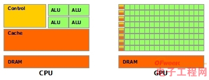

## GPU/CPU
---
1. 首先, CPU和GPU的设计目的不同
    - CPU需要很强的通用性来处理各种不同的数据类型，同时又要逻辑判断又会引入大量的分支跳转和中断的处理。这些都使得CPU的内部结构异常复杂; 所以CPU一般由几个针对顺序串行处理而优化的内核组成
    - 
        - ALU: 算数运算单元
        - 大缓存: 降低读取延迟,
        - 逻辑控制单元
            - 分支预测
            - 数据转发: 当一些指令依赖前面的指令结果时，数据转发的逻辑控制单元决定这些指令在pipeline中的位置并且尽可能快的转发一个指令的结果给后续的指令。这些动作需要很多的对比电路单元和转发电路单元.
    - 而GPU面对的则是类型高度统一的、相互无依赖的大规模数据和不需要被打断的纯净的计算环境. 所以一般GPU具有一个大规模并行架构，由数千个更小，效率更高的内核组成，用于同时处理多个任务。
    - 
        - dram: 需要访问的数据保存在dram中而不是cache里面
        - GPU的缓存不是保存后面需要访问的数据, 而是为thread提供服务的。如果有很多线程需要访问同一个相同的数据, 缓存会合并这些访问，然后再去访问dram, 获取数据后cache会转发这个数据给对应的线程，这个时候是数据转发的角色。但是由于需要访问dram，自然会带来延时的问题. 
    - 图解
2. 显存 内存
3. 结论
    - CPU: 擅长逻辑控制, 串行的运算. 即复杂的,通用类型计算. 
        - 逻辑控制, 串行运算, 通用计算
    - GPU: 擅长大规模并发计算.
        - 高并发(简单)运算, 高吞吐量运算, 计算密集(ALU单元)
    - 就跟特种兵队伍和普通军队的区别一样, 各自有适合的场景.
4. GPU应用
    - 密码破解(如区域链矿机): 多数都是GPU, 而且针对比特币有特定显卡
    - 像素渲染(如游戏渲染): 在屏幕上描绘多边形,贴图时(不太了解计算机图形学), 每个像素点的RGB都可以独立计算, 但又不需要复杂强大的计算能力.
    - 问题: web服务也算是高并发, 适合用GPU做么?
        - _个人感觉不合适. 首先,web服务并非简单计算,有复杂的逻辑控制. 其次,现在并没有现成的相应技术实现_
5. 补充
    - **[WHAT IS GPU-ACCELERATED COMPUTING?](http://www.nvidia.com/object/what-is-gpu-computing.html)**
    - **[CPU和GPU的设计区别](http://www.cnblogs.com/biglucky/p/4223565.html)**
    - **[为什么 GPU 会成为通用计算的宠儿](https://yq.aliyun.com/articles/178097)**
    - [GPU编程环境:OpenCL/OpenGL/DirectX/CUDA](https://www.zybuluo.com/johntian/note/673607)
    - [图形渲染及优化—渲染管线基础](http://gad.qq.com/article/detail/26926)